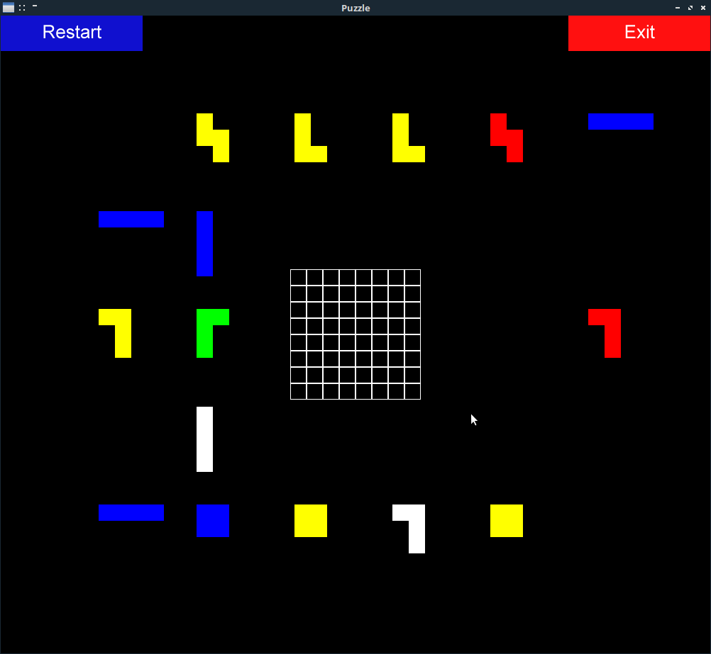

# Puzzle Game

### About

Simple PySDL2 puzzle game.

### Screenshot



### Requirements

Application is tested with python version 3.6.7.

##### Aditional Libraries

- [PySDL2](https://github.com/marcusva/py-sdl2)

### Installation

```
git clone https://github.com/fuzzy69/puzzlegame.git
cd puzzlegame/
virtualenv -p /usr/bin/python3 env
. env/bin/activate
pip install -r requirements.txt
```

### Usage

Run game with:
```
python main.py
```